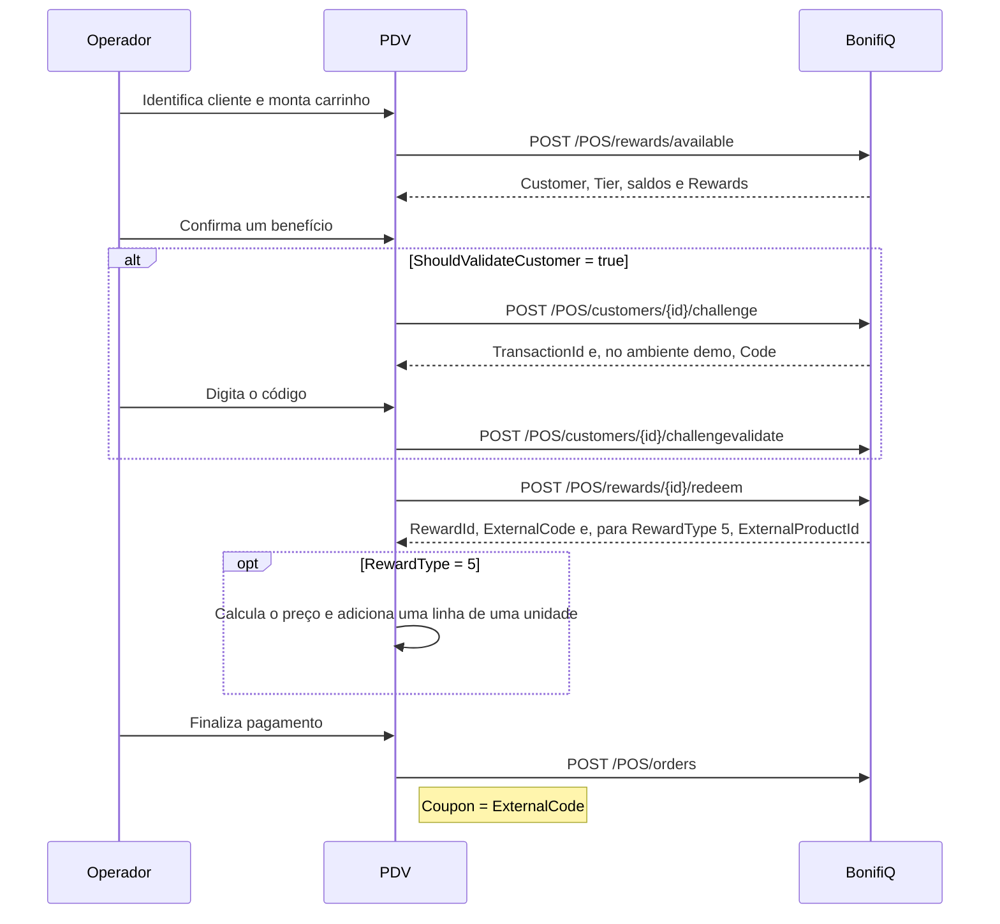

# Fluxo e responsabilidades

## Sequência da venda



## Estados explícitos

O reducer da integração usa os estados:

```text
idle → loading-rewards → ready
ready → sending-challenge → awaiting-code → validating-code
ready/validating-code → redeeming → reward-applied
reward-applied → cancelling-reward ou submitting-order
qualquer operação → error → retry com a mesma chave
```

Isso evita combinar booleanos incompatíveis, como “resgatando” e “editando carrinho” ao mesmo tempo.

## Matriz de integração

| Momento no PDV | Chamada | Dados principais | Persistir | Compensação |
|---|---|---|---|---|
| Cliente ou carrinho muda | `POST /POS/rewards/available` | Cliente, valor, desconto e produtos | `Customer`, tier, `ShouldValidateCustomer` e `ShouldValidateCustomerSignup` durante a venda | Descartar resposta anterior; a mais recente vence |
| Benefício confirmado | `POST .../challenge` | Cliente e `TransactionId`; dados cadastrais somente no signup | `TransactionId` | Retry com o mesmo ID |
| Código informado | `POST .../challengevalidate` | `TransactionId` e código | Nenhum dado novo | Manter popup para nova tentativa |
| Qualquer recompensa | `POST /POS/rewards/{id}/redeem` | Cliente, `OriginalKey` e `Value` somente para cashback | `RewardId`, `ExternalCode`, `OriginalKey` | `DELETE /POS/rewards/{RewardId}` |
| Produto ou brinde, após redeem | Nenhuma chamada adicional | `ExternalProductId`, modo, valor e preço efetivo já validados | SKU offline e linha separada de uma unidade | Estornar e só então remover a linha |
| Venda concluída | `POST /POS/orders` | Total líquido, cliente, produtos e `Coupon` | ID original do pedido | Cancelamento total ou parcial |
| Devolução parcial | `POST /POS/{orderId}/partialcancel` | Valor líquido, `CancelKey` e produtos devolvidos | `CancelKey` | Retry com a mesma chave |

## Regras importantes

- Reconsultar benefícios quando carrinho ou desconto próprio mudar.
- Ignorar respostas antigas que terminem depois de uma consulta mais recente.
- Só permitir seleção quando `CanUse=true`.
- Exibir `Requirements` e `CannotUseReason` retornados pela API; não recalcular elegibilidade localmente.
- Em `/available`, enviar o produto e seu preço efetivo. `ProductDiscountPrice` menor que `ProductPrice` indica promoção.
- Para produto offline diferente de `FreeGift`, a BonifiQ exige SKU correspondente, benefício financeiro real e cumulatividade quando houver promoção. `FreeGift` não exige que o produto já esteja no carrinho.
- O redeem de `RewardType=5` não recebe produto, quantidade, preço, promoção ou `ForceGenerateCoupon`; ele sempre confirma uma unidade.
- A resposta POS não possui `ProductDiscountTotal`. O PDV calcula o preço final a partir de `ProductDiscountMode` e `ProductDiscountValue`.
- Gerar `OriginalKey` uma vez na confirmação e reutilizá-la em retries.
- Se o challenge pedir `ShouldInformPhone` ou `ShouldInformEmail`, repetir uma vez com apenas o contato solicitado e o mesmo `TransactionId`.
- Resgate e registro do pedido são operações distintas.
- Se o operador voltar após resgatar, o estorno precisa concluir antes da edição.
- Registrar o pedido mesmo sem recompensa para permitir pontuação.

## OTP na demonstração

Em preview, a criação do token pode retornar `Success=false` porque o envio externo está bloqueado, mas ainda devolver `Code`. Quando houver `Code`, a demo o exibe e permite validar; o erro de entrega não substitui o código no popup.

Em produção, normalmente o cliente recebe o código pelo canal configurado e ele pode não ser devolvido ao PDV.
